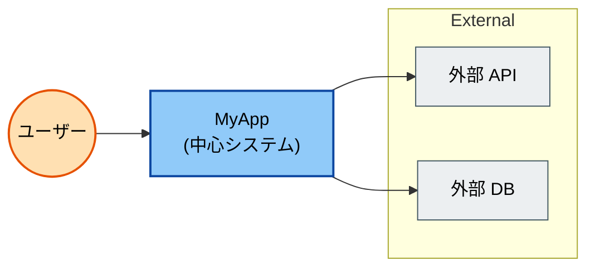
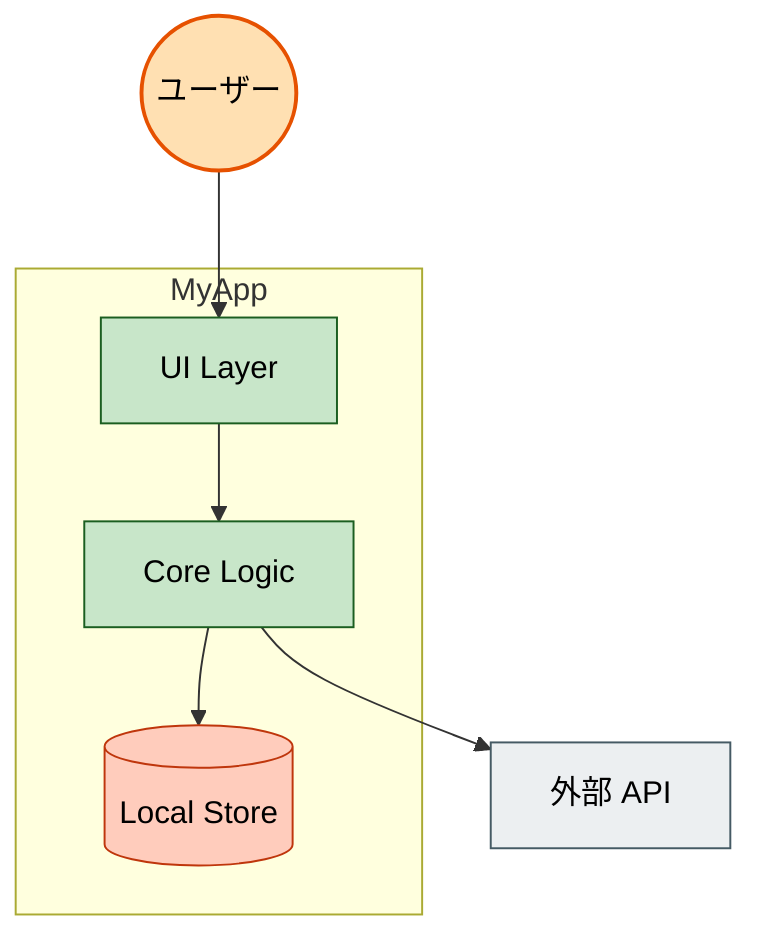
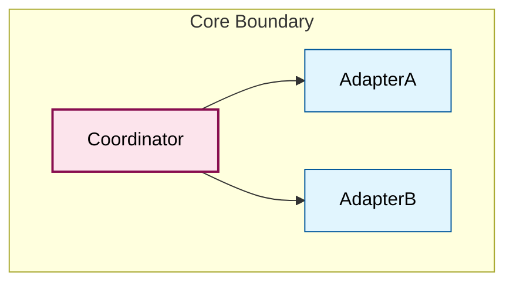
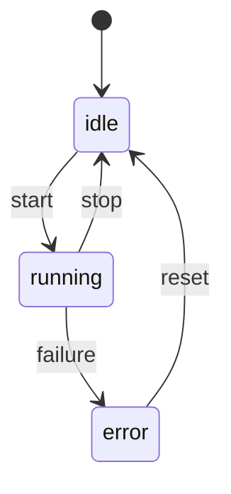
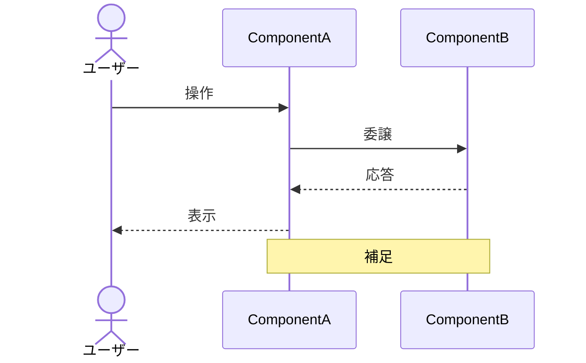
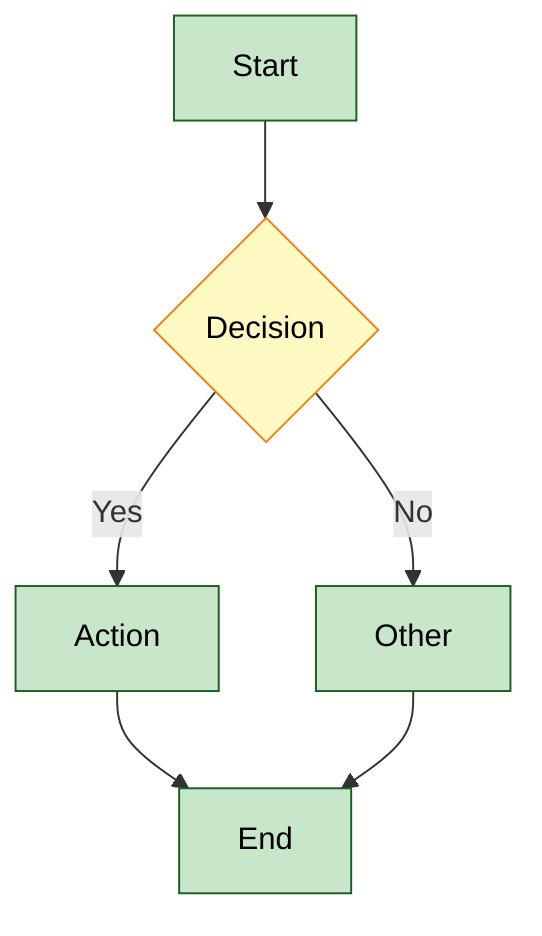
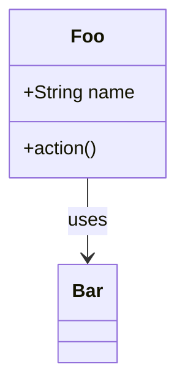
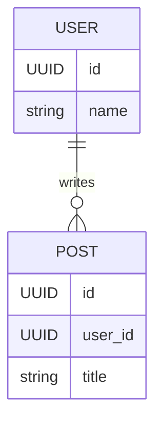

# Mermaid Cheatsheet

drive-partner / 他プロジェクトでよく使う Mermaid 記法の早見表。

## 重要: 全図共通の冒頭

すべての Mermaid ブロックの先頭に以下を入れる。GitHub のダーク/ライト両モードで安定した見え方になる。

```
%%{init: {'theme':'default'}}%%
```

加えて、`classDef` で **fill / stroke / stroke-width / color** を全部明示する。`color:#000` を必ず指定するとダークモードでも文字が消えない。

```
classDef boxStyle fill:#90CAF9,stroke:#0D47A1,stroke-width:2px,color:#000
```

## C4-like 図 (Context / Container / Component)

**Mermaid の `C4Context` / `C4Container` / `C4Component` 構文は使わない**。レイアウト崩壊・ラベルオーバーラップが起きやすい既知の問題があるため。代わりに **`flowchart` + `subgraph` + `classDef`** で同等表現する。

### L1 Context (例)



### L2 Container (例)



### L3 Component (例)



## 状態機械



ラベルに `\n` を入れるとレンダリングが不安定なことがある。**1 行の短い動詞** で書くのが安全。詳細は表で別途説明する。

## シーケンス



`Note` の中身に `<br/>` で改行可。`\n` は避ける。

## フローチャート (依存・データフロー)



## クラス図 (必要時のみ)



## ER 図 (DB 構造)



## 色パレット (両モード対応)

ライト / ダーク両方で可読性が確保できる pastel fills + dark text:

| 用途 | fill | stroke |
|---|---|---|
| 人 (Person) | `#FFE0B2` | `#E65100` |
| 中心システム | `#90CAF9` | `#0D47A1` |
| 外部システム | `#ECEFF1` | `#455A64` |
| Container | `#C8E6C9` | `#1B5E20` |
| Component (中心) | `#FCE4EC` | `#880E4F` |
| Adapter / 周辺 | `#E1F5FE` | `#01579B` |
| 補助 | `#FFF9C4` | `#F57F17` |
| DB / store | `#FFCCBC` | `#BF360C` |
| Infrastructure | `#F3E5F5` | `#4A148C` |

文字色は **常に `#000`** で固定。

## Tips

- GitHub の PR / Issue / README で **そのままレンダリング**
- 描画が崩れる場合は VS Code の Mermaid プレビューで確認
- 長すぎる説明はノード内ではなく **本文側に箇条書き** で記す
- 矢印のラベルは引用符付き (`|"text"|`) で安全側に
